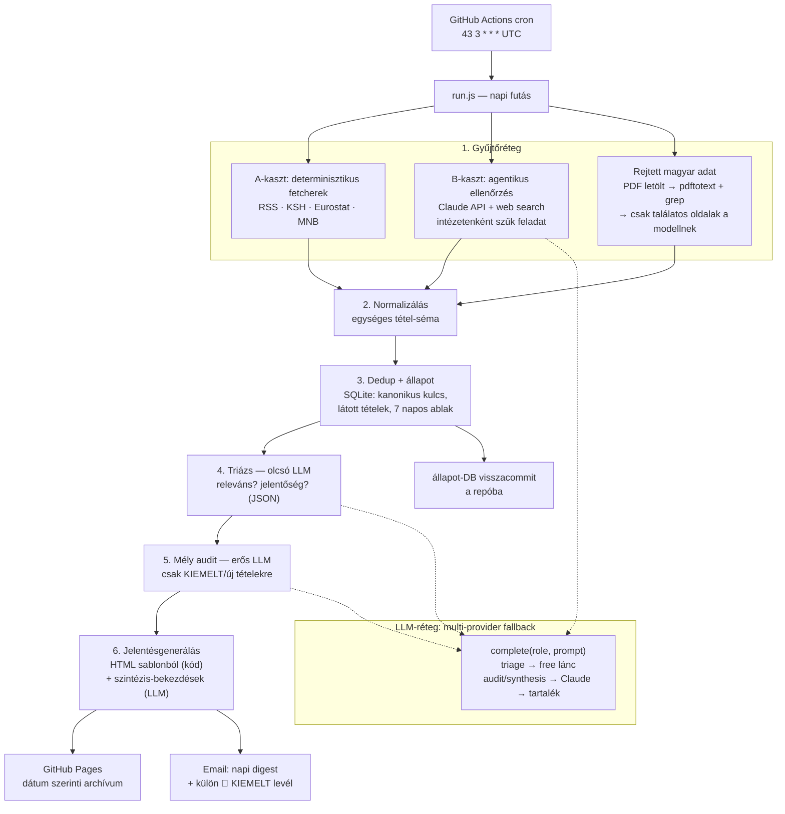

# Survey Monitor — Architektúra-vázlat és MVP-terv

**Projekt:** automatizált magyar közéleti kutatás- és adatmonitor
**Alap:** a `SURVEY_figyelés_prompt.docx` specifikáció (26 szekció) gépi megvalósítása
**Státusz:** tervezési dokumentum, v0.1 — a repo indulása előtt

---

## 1. Cél és vezérelvek

A rendszer minden reggel 7:00 (Europe/Budapest) előtt kézbesít egy jelentést
az előző napi futás óta megjelent magyar és nemzetközi közvélemény-kutatásokról,
intézeti felmérésekről és hivatalos statisztikai adatközlésekről, a
specifikáció frissességi és jelentőségi besorolásai szerint.

A specifikációból következő négy tervezési elv, amelyre az egész
architektúra épül:

1. **Determinisztikus, ami determinisztikus lehet.** Dátumok, dedup,
   frissességi státuszok, ellenőrzési napló, "korábban szerepelt-e" —
   ezek kódban élnek, nem a modell önbevallásában. A modell csak ott
   dolgozik, ahol ítélet kell (relevancia, jelentőség, szintézis,
   rejtett magyar adat).
2. **Becsületes részlegesség** (spec 24. pont). A rendszer sosem
   állítja, hogy egy forrást ellenőrzött, ha nem tette; a napló a kód
   tényadataiból áll össze. A v1 szándékosan szűkebb forráskörrel
   indul, és ezt a jelentés kimondja.
3. **A jelentés sosem marad el.** LLM-keret kimerülése, egy forrás
   elérhetetlensége vagy egy provider kiesése degradált, de működő
   jelentést eredményez — soha nem csendes hibát.
4. **Költségtudatosság.** Olcsó/ingyenes modell triázsol, a drága
   modell csak kiemelt tételekre és szintézisre fut; a napi cél
   $0,02–0,10.

---

## 2. Rendszeráttekintés



---

## 3. Futtatókörnyezet

**GitHub Actions, ütemezett workflow.** Nincs saját szerver.

- **Cron:** `43 3 * * *` (UTC). Nyáron 5:43, télen 4:43 budapesti
  indulás. A "ferde" perc szándékos: a kerek órák a legzsúfoltabbak az
  Actions megosztott sorában (10–40 perc késés is előfordulhat). A
  puffer garantálja a cél-SLA-t: **email a postaládában 7:00
  Europe/Budapest előtt.** Mellékhatás: a jelentés az előző nap teljes
  termését fedi; az aznap reggeli KSH-közlés a másnapi levélben lesz.
- **Manuális trigger** (`workflow_dispatch`) fejlesztéshez és pótfutáshoz.
- **Timeout:** a workflow-ra 30 perc; forrásonkénti fetch-timeout 20 s.
- **Hibaértesítés:** ha a futás elhasal, arról is megy email ("a mai
  jelentés nem készült el, ok: …") — a jelentés sosem marad el csendben.
- **Titkok** (Actions Secrets): `ANTHROPIC_API_KEY`, `GEMINI_API_KEY`,
  `GROQ_API_KEY` / `OPENROUTER_API_KEY`, email-küldő kulcs. `.env` soha
  nem kerül a repóba (HF3-gyakorlat folytatódik).
- **Kimenetek:** a HTML-jelentés a `gh-pages` ágra (vagy `docs/`
  mappába) kerül dátumozott útvonalon (`/2026/07/22.html`) + egy mindig
  a legfrissebbre mutató `index.html`; az állapot-DB a futás végén
  visszacommitolva a main ágra.
- **Megjegyzés a privát repóhoz:** GitHub Pages privát repónál csak
  fizetős csomagban publikus. Két opció: (a) a monitor-repo legyen
  publikus (a jelentés úgyis linkgyűjtemény + saját szöveg, nem
  másolt tartalom), (b) külön publikus repo csak a kimenetnek.
  **Döntés az induláskor.**

---

## 4. Adatmodell és állapot

**SQLite** (`state/monitor.db`), a repóba visszacommitolva. Ezen a
méreten (pár száz tétel/hét) nem indokolt külső adatbázis.

### Táblák (vázlat)

```
items(
  id INTEGER PK,
  canonical_key TEXT UNIQUE,   -- lásd lent
  source_id TEXT,              -- pl. 'median', 'ksh', 'telex'
  kind TEXT,                   -- 'kutatas' | 'hivatalos_adat' | 'sajto' | 'nemzetkozi'
  title TEXT,
  url TEXT,                    -- eredeti, elsődleges forrás URL-je
  press_urls TEXT,             -- JSON: sajtófeldolgozások
  published_at TEXT,           -- ISO; NULL ha nem ismert → "pontos publikációs idő nem elérhető"
  fieldwork_period TEXT,       -- adatfelvétel / referencia-időszak
  first_seen_at TEXT,          -- mikor látta először a monitor
  freshness TEXT,              -- futáskor számolt: UJ_24H | H24_48 | KORABBI | KIHAGYOTT_MOST
  significance TEXT,           -- KIEMELT | FONTOS | FIGYELENDO (triázs eredménye)
  triage_json TEXT,            -- a triázs teljes strukturált kimenete
  audit_json TEXT,             -- mély audit eredménye (ha futott)
  revision_of INTEGER          -- adatrevízió esetén az eredeti tételre mutat
)

source_checks(
  run_id TEXT, source_id TEXT,
  status TEXT,                 -- OK_UJ | OK_NINCS_UJ | RESZLEGES | HIBA
  detail TEXT,                 -- pl. HTTP-hiba, robots.txt, timeout
  checked_at TEXT
)

runs(
  run_id TEXT PK, started_at TEXT, finished_at TEXT,
  providers_used TEXT,         -- JSON: melyik szerepet melyik modell futtatta
  cost_estimate REAL,
  report_url TEXT, email_status TEXT
)
```

### Kanonikus kulcs (dedup)

`slug(intézet/forrás) + slug(téma) + adatfelvétel/referencia-időszak` —
kódban képezve, normalizálás után. Ugyanazon kutatás második
sajtócikke így nem új tétel, hanem a meglévő `press_urls` bővítése.
A "Korábbi jelentésben szerepelt: Igen/Nem/Nem megállapítható" mező
determinisztikus: a kulcs megléte a DB-ben.

### Frissesség (spec 14. pont) — tisztán kód

A `published_at` (ha ismert) vagy `first_seen_at` alapján számolva a
futás pillanatában. A "⚠️ korábban kihagyott, most azonosított" azt
jelenti: `published_at` > 48 óra, de `first_seen_at` = most.
Óra-percet a rendszer soha nem talál ki — ha a forrás nem adja, a
mező NULL, a jelentésben a spec szerinti szöveg jelenik meg.

---

## 5. Gyűjtőréteg

### A-kaszt — determinisztikus fetcherek

Forrásonként egy kis modul (`sources/telex.js`, `sources/ksh.js`, …)
egységes interfésszel: `fetchNew(since) → RawItem[]`. RSS-parse vagy
célzott HTML-lekérés (listaoldal), 20 s timeout, User-Agent beállítva,
udvarias ütemezés. A `source_checks` sor a modul tényleges eredményéből
íródik — a napló ettől "magától igaz".

### B-kaszt — agentikus ellenőrzés

A rendszertelen, scrape-ellenálló forrásoknál (kis intézetek) a Claude
API web search toollal, **forrásonként szűk, lehatárolt feladat**:
"Publikált-e X intézet új kutatást az elmúlt 7 napban? Válasz kizárólag
a megadott JSON-sémában, URL-t csak ténylegesen megtalált oldalról."
A válasz sémavalidáláson megy át; a talált URL-t a kód le is kéri
(létezik-e), mielőtt tételként felvenné — kitalált URL így nem juthat be.

### Rejtett magyar adat (spec 4–5. pont)

A friss nemzetközi riportoknál kétlépcsős, költségtakarékos ellenőrzés:

1. **Kód:** PDF letöltése → `pdftotext` → keresés `Hungary|Hungarian|
   Magyarorsz` mintára; országtáblák, appendix jellemzően így megvan.
2. **Modell:** csak a találatos oldalak szövegét kapja meg, azzal a
   kérdéssel: van-e külön magyar minta/adatsor, mi az eredmény,
   releváns-e. Nincs találat → nincs modellhívás.

---

## 6. LLM-réteg — multi-provider fallback

Vékony absztrakció: `complete(role, prompt, schema)`. A hívó kód nem
tud providerről; a szerepek és láncok configban (`config/llm.json`):

| Szerep | Feladat | Lánc (elsődleges → tartalék) |
|---|---|---|
| `triage` | releváns? jelentőség? kind? (JSON) | Gemini Flash (free) → Groq/Llama (free) → Claude Haiku |
| `agentic_check` | B-kaszt forrásellenőrzés web searchcsel | Claude Haiku → Claude Sonnet |
| `audit` | mély audit KIEMELT/új tételekre | Claude Sonnet → Gemini Pro → OpenRouter :free nagymodell |
| `synthesis` | 19–20. pont bekezdései | Claude Sonnet → Gemini Pro → **kihagyás** |

Szabályok:

- **Váltás triggere determinisztikus:** 402 (keret), 429 (kvóta/rate
  limit), 5xx vagy ismételt hiba → következő láncszem. Minden váltás a
  `runs.providers_used`-be és a jelentés láblécébe kerül ("a mai
  triázst Gemini Flash futtatta").
- **JSON-szerződés:** minden szerephez rögzített séma; a kimenet
  sémavalidálva, hibás JSON-nál egy retry, utána a lánc lép tovább.
  Mivel bármelyik modell futtathatja a szerepet, a séma a szerződés,
  nem a modell.
- **Batch-elt triázs:** 10–20 tétel/hívás, hogy a napi ~50–150 tétel
  5–10 hívásból elférjen a legszűkebb free tierben is.
- **Degradáció:** a `synthesis` végső fallbackje a kihagyás — a
  jelentés ilyenkor táblázatokkal, bekezdések nélkül megy ki. Az adat
  akkor is ott van; a jelentés sosem marad el.
- **Implementációkor ellenőrizendő:** az aktuális free tier kvóták és
  ingyenes modellnevek (Gemini, Groq, OpenRouter, Mistral) — ezek
  gyorsan változnak, a config ezért él külön fájlban.

---

## 7. Jelentésgenerálás és kézbesítés

**A jelentés vázát kód generálja sablonból** (a spec 17–23. pontja
szerinti sorrendben); a modell kizárólag a két szintézis-szekció
szövegét írja:

1. 🕒 / 📊 fejléc-sorok (utolsó új kutatás / utolsó jelentős adat)
2. A) 🇭🇺 magyar kutatások · B) 🌍 nemzetközi magyar adattal ·
   C) 📊 hivatalos adatok — táblázatok, spec szerinti oszlopokkal és
   rendezéssel (frissesség, azon belül jelentőség)
3. "Mi jelent meg az utolsó 24 órában?" — LLM-bekezdés (max 1–2)
4. "Mi változott az előző jelentéshez képest?" — kódból generált
   változáslista
5. Részletes audit tételenként (triázs- + audit-JSON-ból renderelve)
6. 📅 Következő figyelendő publikációk — a KSH közzétételi naptárából
   és MNB-naptárból **gépileg beolvasva**, sosem kitalálva
7. Teljes ellenőrzési napló — a `source_checks` táblából
8. Lábléc: futási idő, használt modellek, becsült költség

**Kimenetek:**

- **GitHub Pages:** dátumozott HTML-archívum + index (legfrissebb),
  egyszerű lista a korábbi napokról. v1-ben statikus, keresés nélkül.
- **Napi digest email:** a jelentés tömörített HTML-változata + link a
  teljes oldalra. Tárgy: `📊 Monitor 2026.07.22 — 2 új kutatás, 1 KSH`.
- **🔴 KIEMELT email:** külön, rövid levél csak akkor, ha aznap volt
  KIEMELT tétel — a tárgysorból látszik, kell-e aznap megnyitni bármit.
- **Hiba-email:** elhasalt futásnál.
- **Küldő szolgáltatás — döntés induláskor:** (a) SMTP Gmail
  app-jelszóval (0 Ft, legegyszerűbb), (b) Resend/Postmark free tier
  (szebb kézbesíthetőség, API). v1-nek az (a) is elég.

---

## 8. MVP forráslista (v1)

Az elv: **becsületesen részleges** — a v1 a lefedettséget kimondja, a
hiányt a napló "MÉG NEM LEFEDETT" szekciója listázza. A pontos
feed-/lista-URL-eket az implementáció első lépése deríti fel és
rögzíti a `config/sources.json`-ban (URL-t nem találunk ki, lekérdezéssel
verifikáljuk).

### Hivatalos statisztika — napi kötelező (A-kaszt)

| Forrás | Mit figyel | Módszer |
|---|---|---|
| KSH | gyorstájékoztatók, friss hírek, kiadványok, közzétételi naptár | listaoldal/RSS + naptár-parse |
| Eurostat | News, Euro indicators, magyar értékkel bíró friss közlések | news-feed + célzott lekérés |
| MNB | közlemények, kamatdöntés, kiemelt jelentések (inflációs, lakáspiaci, hitelezési) | publikációs listaoldal + naptár |

### Híroldalak (A-kaszt, RSS ahol van)

v1: **Telex, 444, HVG, 24.hu, Portfolio, Economx, Infostart, Népszava,
Szabad Európa, Válasz Online** — kulcsszó-előszűrés kódban (a spec 3.
pontjának listája), utána triázs.
v2-re marad: Index, ATV, RTL, Magyar Nemzet, Mandiner, Origo, Magyar
Hang, 168.hu, Világgazdaság, Magyar Narancs, Klubrádió, HírTV, Blikk.

### Magyar intézetek

| Intézet | Kaszt (becslés) |
|---|---|
| Medián, Závecz, Republikon, Publicus, IDEA, 21 Kutatóközpont, Nézőpont, Századvég | A vagy B — az implementáció első napján derül ki, kinek van gépbarát listaoldala; ami nem az, B-kasztba esik |
| Iránytű, Real-PR 93, Europion/Opinio, Magyar Társadalomkutató, Minerva | B-kaszt (agentikus, heti mélységű ellenőrzés) |

Megjegyzés: az intézeti publikációk jellemzően a sajtón keresztül is
becsatornázódnak (a híroldal-fetcherek elkapják), a B-kaszt így
biztonsági háló, nem egyetlen csatorna.

### Nemzetközi (B-kaszt + rejtett-magyar-adat pipeline)

v1: **Pew, Eurobarometer, Ipsos, Europe Elects, Politico Poll of
Polls** — heti mélységű agentikus ellenőrzés + minden friss riporton a
PDF/grep lépés.
v2-re: YouGov, Gallup, ECFR, OECD/IMF/World Bank/EC országjelentések,
WHO/UNICEF, NEAK/NNGYK/Oktatási Hivatal/NFSZ témafüggő források.

---

## 9. Költségbecslés (napi)

| Tétel | Becslés |
|---|---|
| Triázs (free tier elsődleges) | ~$0 |
| Agentikus B-kaszt ellenőrzések (Haiku + web search, ~5–10 hívás) | $0,01–0,04 |
| Mély audit (Sonnet, 0–5 tétel/nap) | $0,00–0,05 |
| Szintézis (Sonnet, 2 rövid bekezdés) | ~$0,005 |
| **Összesen** | **~$0,02–0,10** · keret-kimerülésnél $0, degradált móddal |

GitHub Actions: napi 1 futás × ~10–20 perc — privát repó ingyenes
keretében is bőven elfér.

---

## 10. Ütemterv — fázisok

1. **F0 — csontváz:** repo, Actions-workflow a cron-nal, "hello"
   jelentés Pages-re, email-küldés működik. *(A teljes kézbesítési
   lánc előbb legyen kész, mint a tartalom.)*
2. **F1 — A-kaszt mag:** KSH + Eurostat + MNB + 4–5 RSS-es híroldal,
   SQLite-állapot, dedup, frissességi státuszok, ellenőrzési napló.
   Jelentés még triázs nélkül, nyers tétellistával.
3. **F2 — LLM-réteg:** provider-absztrakció + fallback-lánc, batch-elt
   triázs JSON-sémával, jelentőségi besorolás, digest + KIEMELT email.
4. **F3 — B-kaszt + rejtett magyar adat:** agentikus
   intézet-ellenőrzések, PDF/grep pipeline, mély audit.
5. **F4 — teljesítés a spec felé:** forrásbővítés v2-listákról,
   következő-publikációk naptár, revíziókezelés, finomhangolás.

Minden fázis végén a rendszer önmagában használható — az F1 már
minden reggel küld valamit, ami igaz.

## 11. Nyitott döntések induláskor

1. Repo neve és láthatósága (Pages-korlát miatt: publikus monitor-repo
   vagy külön publikus output-repo).
2. Email-küldő: Gmail SMTP vagy Resend.
3. Free tier providerek aktuális kvótái és modellnevei (implementáció
   napján ellenőrizve, configba rögzítve).
4. Melyik intézetnek van gépbarát listaoldala (F1/F3 határvonal).
