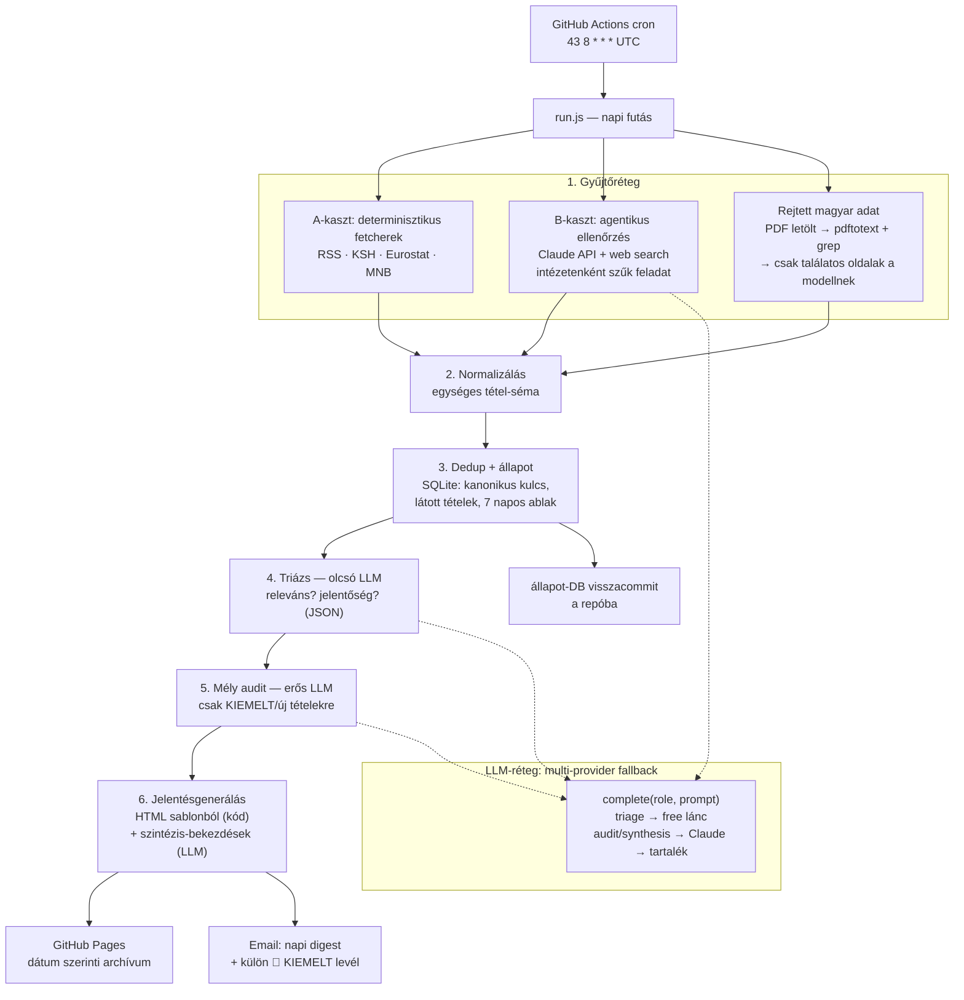

# Survey Monitor — Architektúra-vázlat és MVP-terv

**Projekt:** automatizált magyar közéleti kutatás- és adatmonitor
**Alap:** a `SURVEY_figyelés_prompt.docx` specifikáció (26 szekció) gépi megvalósítása
**Státusz:** tervezési dokumentum, v0.1 — a repo indulása előtt

---

## 1. Cél és vezérelvek

A rendszer minden nap 15:00 (Europe/Budapest) előtt kézbesít egy jelentést
az előző napi futás óta megjelent magyar és nemzetközi közvélemény-kutatásokról,
intézeti felmérésekről és hivatalos statisztikai adatközlésekről, a
specifikáció frissességi és jelentőségi besorolásai szerint.

A specifikációból következő négy tervezési elv, amelyre az egész
architektúra épül:

1. **Determinisztikus, ami determinisztikus lehet.** Dátumok, dedup,
   frissességi státuszok, ellenőrzési napló, "korábban szerepelt-e" —
   ezek kódban élnek, nem a modell önbevallásában. A modell csak ott
   dolgozik, ahol ítélet kell (relevancia, jelentőség, szintézis,
   rejtett magyar adat).
2. **Becsületes részlegesség** (spec 24. pont). A rendszer sosem
   állítja, hogy egy forrást ellenőrzött, ha nem tette; a napló a kód
   tényadataiból áll össze. A v1 szándékosan szűkebb forráskörrel
   indul, és ezt a jelentés kimondja.
3. **A jelentés sosem marad el.** LLM-keret kimerülése, egy forrás
   elérhetetlensége vagy egy provider kiesése degradált, de működő
   jelentést eredményez — soha nem csendes hibát.
4. **Költségtudatosság.** Olcsó/ingyenes modell triázsol, a drága
   modell csak kiemelt tételekre és szintézisre fut; a napi cél
   $0,02–0,10.

---

## 2. Rendszeráttekintés


```mermaid
flowchart TD
    CRON["GitHub Actions cron\n43 8 * * * UTC"] --> RUN[run.js — napi futás]

    subgraph GYUJTES["1. Gyűjtőréteg"]
        A["A-kaszt: determinisztikus fetcherek\nRSS · KSH · Eurostat · MNB"]
        B["B-kaszt: agentikus ellenőrzés\nClaude API + web search\nintézetenként szűk feladat"]
        C["Rejtett magyar adat\nPDF letölt → pdftotext + grep\n→ csak találatos oldalak a modellnek"]
    end

    RUN --> A
    RUN --> B
    RUN --> C

    A --> NORM["2. Normalizálás\negységes tétel-séma"]
    B --> NORM
    C --> NORM

    NORM --> DEDUP["3. Dedup + állapot\nSQLite: kanonikus kulcs,\nlátott tételek, 7 napos ablak"]
    DEDUP --> TRIAGE["4. Triázs — olcsó LLM\nreleváns? jelentőség? (JSON)"]
    TRIAGE --> AUDIT["5. Mély audit — erős LLM\ncsak KIEMELT/új tételekre"]
    AUDIT --> REPORT["6. Jelentésgenerálás\nHTML sablonból (kód)\n+ szintézis-bekezdések (LLM)"]

    REPORT --> PAGES["GitHub Pages\ndátum szerinti archívum"]
    REPORT --> MAIL["Email: napi digest\n+ külön 🔴 KIEMELT levél"]
    DEDUP --> COMMIT["állapot-DB visszacommit\na repóba"]

    subgraph LLMLAYER["LLM-réteg: multi-provider fallback"]
        P["complete(role, prompt)\ntriage → free lánc\naudit/synthesis → Claude → tartalék"]
    end

    TRIAGE -.-> P
    AUDIT -.-> P
    B -.-> P
```

---

## 3. Futtatókörnyezet

**GitHub Actions, ütemezett workflow.** Nincs saját szerver.

- **Cron:** `43 8 * * *` (UTC). Nyáron 10:43, télen 9:43 budapesti
  indulás. A "ferde" perc szándékos: a kerek órák a legzsúfoltabbak az
  Actions megosztott sorában. **A cron-időt a mérés vezérli, nem becslés:**
  az ütemezett futások ténylegesen 112–218 perccel a cron után indultak
  (nem a korábban feltételezett 10–40 perccel) — az Actions ütemezett sora
  ennyit csúszik. **Cél-SLA: email a postaládában 15:00 Europe/Budapest
  előtt.** A szűkebb korlát a nyár: 15:00 CEST = **13:00 UTC** (télen 15:00
  CET = 14:00 UTC, bővebb), ezért a nyári korlátra méretezünk. A `43 8 * * *`
  a MÉRT 218 perces maximummal is tart: 08:43 + 3:38 = 12:21 UTC = 14:21
  CEST → ~40 perc tartalék 15:00-ig (télen 13:21 CET, ~100 perc). A
  2026-08-08-i 112 perc a kedvező vég — nem erre tervezünk. A korábbi
  `43 0 * * *` a 7:00-s SLA-hoz tartozott; az SLA-t 15:00-ra tolva a cron
  08:43-ra kerül. Mellékhatás: a jelentés az előző futás óta megjelent
  termést fedi. A "since last run" ablak a tényleges előző futás
  `started_at`-jához kötött (nem a cron-időhöz), ezért az átállás nem hagy
  ki és nem duplikál tartalmat: az ablak folytonos marad. Az átállás napján
  egyszeri, **~30–34h** szélesebb ablak (utolsó futás 2026-08-08 02:35 UTC →
  következő 08-09 08:43 UTC + sorállás); a szélesebb ablak SZUPERHALMAZ, így
  nem hiányzik tartalom, a `canonical_key`-dedup pedig a már látott tételek
  újrabeszúrását zárja ki. A tárgysor "X új (24h)" és az UJ_24H szűrés NEM
  torzul: a frissesség a `computeFreshness` fix, `now`-hoz mért 24h korán
  alapul (publikációs idő szerint), nem a since-ablakon — a másnapos átállás
  ezt nem érinti.
- **Manuális trigger** (`workflow_dispatch`) fejlesztéshez és pótfutáshoz.
- **Timeout:** a workflow-ra 30 perc; forrásonkénti fetch-timeout 20 s.
- **Hibaértesítés:** ha a futás elhasal, arról is megy email ("a mai
  jelentés nem készült el, ok: …") — a jelentés sosem marad el csendben.
- **Titkok** (Actions Secrets): `ANTHROPIC_API_KEY`, `GEMINI_API_KEY`,
  `GROQ_API_KEY` / `OPENROUTER_API_KEY`, email-küldő kulcs. `.env` soha
  nem kerül a repóba (HF3-gyakorlat folytatódik).
- **Kimenetek:** a HTML-jelentés a `gh-pages` ágra (vagy `docs/`
  mappába) kerül dátumozott útvonalon (`/2026/07/22.html`) + egy mindig
  a legfrissebbre mutató `index.html`; az állapot-DB a futás végén
  visszacommitolva a main ágra.
- **Megjegyzés a privát repóhoz:** GitHub Pages privát repónál csak
  fizetős csomagban publikus. Két opció: (a) a monitor-repo legyen
  publikus (a jelentés úgyis linkgyűjtemény + saját szöveg, nem
  másolt tartalom), (b) külön publikus repo csak a kimenetnek.
  **Döntés az induláskor.**

---

## 4. Adatmodell és állapot

**SQLite** (`state/monitor.db`), a repóba visszacommitolva. Ezen a
méreten (pár száz tétel/hét) nem indokolt külső adatbázis.

### Táblák (vázlat)

```
items(
  id INTEGER PK,
  canonical_key TEXT UNIQUE,   -- lásd lent
  source_id TEXT,              -- pl. 'median', 'ksh', 'telex'
  kind TEXT,                   -- 'kutatas' | 'hivatalos_adat' | 'sajto' | 'nemzetkozi'
  title TEXT,
  url TEXT,                    -- eredeti, elsődleges forrás URL-je
  press_urls TEXT,             -- JSON: sajtófeldolgozások (F2 javító kör: report-időben
                               -- töltjük, lásd lent; DB-perzisztálás F3-ig üres)
  published_at TEXT,           -- ISO; NULL ha nem ismert → "pontos publikációs idő nem elérhető"
  fieldwork_period TEXT,       -- adatfelvétel / referencia-időszak
  first_seen_at TEXT,          -- mikor látta először a monitor
  freshness TEXT,              -- futáskor számolt: UJ_24H | H24_48 | KORABBI | KIHAGYOTT_MOST
  significance TEXT,           -- KIEMELT | FONTOS | FIGYELENDO (triázs eredménye)
  triage_json TEXT,            -- a triázs teljes strukturált kimenete
  audit_json TEXT,             -- mély audit eredménye (ha futott)
  revision_of INTEGER          -- adatrevízió esetén az eredeti tételre mutat
)

source_checks(
  run_id TEXT, source_id TEXT,
  status TEXT,                 -- OK_UJ | OK_NINCS_UJ | RESZLEGES | HIBA
  detail TEXT,                 -- pl. HTTP-hiba, robots.txt, timeout
  checked_at TEXT
)

runs(
  run_id TEXT PK, started_at TEXT, finished_at TEXT,
  providers_used TEXT,         -- JSON: melyik szerepet melyik modell futtatta
  report_url TEXT, email_status TEXT
)
```

> **Megj. a `runs` sémához:** a `cost_estimate` oszlop **nincs** a sémában
> (token-alapú költségbecslés nélkül üresen maradna — lásd 8. pont és
> `src/state/db.js`). Régi, még a kivétel előtt létrehozott DB-kben fizikailag
> maradhat egy **inert** `cost_estimate` oszlop: a kód nem írja/olvassa, az
> eltávolítása destruktív rebuild lenne, ezért szándékosan érintetlen.

### Kanonikus kulcs (dedup)

`slug(intézet/forrás) + slug(téma) + adatfelvétel/referencia-időszak` —
kódban képezve, normalizálás után. Ugyanazon kutatás második
sajtócikke így nem új tétel, hanem a meglévő `press_urls` bővítése.
A "Korábbi jelentésben szerepelt: Igen/Nem/Nem megállapítható" mező
determinisztikus: a kulcs megléte a DB-ben.

**F2 javító kör — cross-source story-dedup (spec 13.):** a forrásonkénti
canonical_key marad az igazságforrás (dedup + `first_seen_at` stabilitás); e
fölé a jelentés generálásakor determinisztikus, LLM nélküli story-csoportosítás
fut (`src/lib/storygroup.js`, küszöbök `config/dedup.json`): azonos hír több
forrásból → egy reprezentáns (leghitelesebb forrás: hivatalos_adat > kutatas >
sajto), a többi a reprezentáns `press_urls`-ébe kerül **a jelentésben,
memóriában**. KEMÉNY intézet-guard a küszöbök fölött: külön intézetet (Závecz vs
Medián) SOHA nem von össze. A `press_urls` DB-oszlop **report-időben nem íródik
vissza** (churn-kerülés; a csoportosítás futásonként újraszámolható) — a
perzisztálás F3, addig az oszlop üres. Minden összevonás naplózva (ellenőrzési
napló + `providers_used`).

### Frissesség (spec 14. pont) — tisztán kód

A `published_at` (ha ismert) vagy `first_seen_at` alapján számolva a
futás pillanatában. A "⚠️ korábban kihagyott, most azonosított" azt
jelenti: `published_at` > 48 óra, de `first_seen_at` = most.
Óra-percet a rendszer soha nem talál ki — ha a forrás nem adja, a
mező NULL, a jelentésben a spec szerinti szöveg jelenik meg.

---

## 5. Gyűjtőréteg

### A-kaszt — determinisztikus fetcherek

Forrásonként egy kis modul (`sources/telex.js`, `sources/ksh.js`, …)
egységes interfésszel: `fetchNew(since) → RawItem[]`. RSS-parse vagy
célzott HTML-lekérés (listaoldal), 20 s timeout, User-Agent beállítva,
udvarias ütemezés. A `source_checks` sor a modul tényleges eredményéből
íródik — a napló ettől "magától igaz".

**Megbízhatósági tétel — az RSS-feedek HOSSZ-korlátosak, nem idő-korlátosak.** Egy
feed a saját ~fix számú legfrissebb tételét adja (pl. sajtófeed ~30–100), a `since`-szűrő
ebből vág idő szerint. Következmény: **ha valaha kimarad egy futás, a kiesett tételek
VÉGLEG elvesznek** — a következő futás szélesebb `since`-ablaka NEM pótolja őket, mert a
pörgő feedek addigra kirotálták azokat a listájukról (a +Nh ablakszélesítés csak akkor
hozna többet, ha a feed még TARTANÁ a régi tételeket). Ez a napi futás megbízhatóságának
valódi tétje: a hiányzó nap nem „behozható" később. (Ezért a `source_checks` magától-igaz
naplója és a „jelentés sosem marad el" vezérelv nem esztétika, hanem adatvesztés-védelem.)

### B-kaszt — agentikus ellenőrzés

A rendszertelen, scrape-ellenálló forrásoknál (kis intézetek) a Claude
API web search toollal, **forrásonként szűk, lehatárolt feladat**:
"Publikált-e X intézet új kutatást az elmúlt 7 napban? Válasz kizárólag
a megadott JSON-sémában, URL-t csak ténylegesen megtalált oldalról."
A válasz sémavalidáláson megy át; a talált URL-t a kód le is kéri
(létezik-e), mielőtt tételként felvenné — kitalált URL így nem juthat be.

### Forrás-ejtési politika (F3, elvi rögzítés)

Egy forrást **NEM ejtünk** azért, mert (a) a tartalma a sajtón át is
látszik, vagy (b) régen publikált. Mindkét indok téves:

- **(a) sajtó-lefedettség ≠ primer forrás.** A sajtón át a kutatás
  *értelmezését* látjuk, nem a primer intézeti közleményt. Az egész
  dedup(a) + `data_backed` logika épp erre a minőségi különbségre épül
  (a primer intézeti tétel a reprezentáns, nem a sajtócím). Ha egy
  intézetnek van élő gépi csatornája, bekötjük — akkor is, ha a sajtó
  amúgy „lefedi".
- **(b) a STALE-kor önmagában nem ejtő ok.** Ha a csatorna ÉL és ingyen
  van (0 kód, rss.js), a határ fölötti kor ellenére is bekötjük
  (`revisit: if-republishes`) — újra-publikáláskor magától megjelenik.
  Precedens: realpr93 (181 nap), tarskutato (~195 nap).

Forrást **CSAK** akkor hagyunk kint / soroljuk B-be, ha:

- **nincs gépi csatorna** — nincs feed és nincs parse-olható lista
  (idea: JS-render SPA; politico_pop: interaktív HTML; europeelects:
  halott végpont) → agentikus B-kaszt; vagy
- **a szervezet megszűnt** (szabadeu: RFE/RL magyar szolgálat leállt
  2025-11) → `revisit: never`, deaktiválás.

A zavecz kifejezetten az ELSŐ esetbe tartozik: a blog-feed 2023-09 óta
halott (nincs használható csatorna) — NEM azért kint, mert a sajtón át
látszik. Ha élő csatornát ad, azonnal bekötjük.

### Rejtett magyar adat (spec 4–5. pont)

A friss nemzetközi riportoknál kétlépcsős, költségtakarékos ellenőrzés:

1. **Kód:** PDF letöltése → `pdftotext` → keresés `Hungary|Hungarian|
   Magyarorsz` mintára; országtáblák, appendix jellemzően így megvan.
2. **Modell:** csak a találatos oldalak szövegét kapja meg, azzal a
   kérdéssel: van-e külön magyar minta/adatsor, mi az eredmény,
   releváns-e. Nincs találat → nincs modellhívás.

---

## 6. LLM-réteg — multi-provider fallback

Vékony absztrakció: `complete(role, prompt, schema)`. A hívó kód nem
tud providerről; a szerepek és láncok configban (`config/llm.json`):

| Szerep | Feladat | Lánc (elsődleges → tartalék) |
|---|---|---|
| `triage` | releváns? jelentőség? kind? (JSON) | Gemini Flash (free) → Groq/Llama (free) → Claude Haiku |
| `agentic_check` | B-kaszt forrásellenőrzés web searchcsel | Claude Haiku → Claude Sonnet |
| `audit` | mély audit KIEMELT/új tételekre | Claude Sonnet → Gemini Pro → OpenRouter :free nagymodell |
| `synthesis` | 19–20. pont bekezdései | Claude Sonnet → Gemini Pro → **kihagyás** |

Szabályok:

- **Váltás triggere determinisztikus:** 402 (keret), 429 (kvóta/rate
  limit), 5xx vagy ismételt hiba → következő láncszem. Minden váltás a
  `runs.providers_used`-be és a jelentés láblécébe kerül ("a mai
  triázst Gemini Flash futtatta").
- **JSON-szerződés:** minden szerephez rögzített séma; a kimenet
  sémavalidálva, hibás JSON-nál egy retry, utána a lánc lép tovább.
  Mivel bármelyik modell futtathatja a szerepet, a séma a szerződés,
  nem a modell.
- **Batch-elt triázs:** 10–20 tétel/hívás, hogy a napi ~50–150 tétel
  5–10 hívásból elférjen a legszűkebb free tierben is.
- **Degradáció:** a `synthesis` végső fallbackje a kihagyás — a
  jelentés ilyenkor táblázatokkal, bekezdések nélkül megy ki. Az adat
  akkor is ott van; a jelentés sosem marad el.
- **Implementációkor ellenőrizendő:** az aktuális free tier kvóták és
  ingyenes modellnevek (Gemini, Groq, OpenRouter, Mistral) — ezek
  gyorsan változnak, a config ezért él külön fájlban.

---

## 7. Jelentésgenerálás és kézbesítés

**A jelentés vázát kód generálja sablonból** (a spec 17–23. pontja
szerinti sorrendben); a modell kizárólag a két szintézis-szekció
szövegét írja:

1. 🕒 / 📊 fejléc-sorok (utolsó új kutatás / utolsó jelentős adat)
2. A) 🇭🇺 magyar kutatások · B) 🌍 nemzetközi magyar adattal ·
   C) 📊 hivatalos adatok — táblázatok, spec szerinti oszlopokkal és
   rendezéssel (frissesség, azon belül jelentőség)
3. "Mi jelent meg az utolsó 24 órában?" — LLM-bekezdés (max 1–2)
4. "Mi változott az előző jelentéshez képest?" — kódból generált
   változáslista
5. Részletes audit tételenként (triázs- + audit-JSON-ból renderelve)
6. 📅 Következő figyelendő publikációk — a KSH közzétételi naptárából
   és MNB-naptárból **gépileg beolvasva**, sosem kitalálva
7. Teljes ellenőrzési napló — a `source_checks` táblából
8. Lábléc: futási idő, használt modellek + a szerep-provider napló
   (`providers_used`, benne a token-`usage` 2026-08-14 óta, és a groq
   `x-ratelimit-*` fejlécek `ratelimit`-ként 2026-08-15 óta — a kvóta-plafon
   mért adatból, nem becslésből; ld. `openai_compat.js`). **Becsült $-költség
   szándékosan NINCS a láblécben:** a $/nap keret nem-kötő korlát (a triázs
   free-tier-en fut, a fizetős rész csak a szintézis ~$0,005/nap, ld. §9), a valódi
   korlát a **kvóta/rate limit**. A `runs.cost_estimate` oszlop ezért kikerült a
   sémából (lásd `src/state/db.js`) és NEM kötjük vissza — LEZÁRVA 2026-08-15,
   ld. BESZAMOLO §12.

**Kimenetek:**

- **GitHub Pages:** dátumozott HTML-archívum + index (legfrissebb),
  egyszerű lista a korábbi napokról. v1-ben statikus, keresés nélkül.
- **Napi digest email:** a jelentés tömörített HTML-változata + link a
  teljes oldalra. Tárgy: `📊 Monitor 2026.07.22 — 2 új kutatás, 1 KSH`.
- **🔴 KIEMELT email:** külön, rövid levél csak akkor, ha aznap volt
  KIEMELT tétel — a tárgysorból látszik, kell-e aznap megnyitni bármit.
- **Hiba-email:** elhasalt futásnál.
- **Küldő szolgáltatás — döntés induláskor:** (a) SMTP Gmail
  app-jelszóval (0 Ft, legegyszerűbb), (b) Resend/Postmark free tier
  (szebb kézbesíthetőség, API). v1-nek az (a) is elég.

### Mi kerül a jelentésbe / a 🔴 KIEMELT-be — a három ortogonális tengely

Amit az olvasó lát (a jelentésben és a KIEMELT-levélben), három EGYMÁSTÓL FÜGGETLEN
szűrő/választás együttese határozza meg. Külön-külön is hibázhatnak, ezért külön is
kell érteni őket; a pipeline-sorrendjük: **freshness → gated/raw → rep/tétel**.

1. **freshness-szűrő — bekerül-e egyáltalán a korpuszba.** (`src/lib/freshness.js`,
   `computeFreshness`.) Csak a frissességi ablakba eső tétel megy triázsra:
   `UJ_24H` / `H24_48` / `KORABBI`; a >48h-s, de csak most először látott tétel
   `KIHAGYOTT_MOST` → kimarad. Ez a cím- és jelentőség-szűrés ELŐTT szűr (pl. a pew
   100 régi tétele 100→0). Következmény: egy újonnan aktivált forrás 0 historikus
   tételt hoz (ld. BESZAMOLO §12 backfill).

2. **gated vs raw — a jelentőség kapuzva.** (`src/triage.js`, `gatedSignificance`; a
   lehúzás láthatósága `src/report.js`.) A `data_backed`-kapu: KIEMELT/FONTOS CSAK
   konkrét adatra/mérésre adható; a puszta politikai hír (data_backed=false)
   legfeljebb FIGYELENDO, KIEMELT SOHA. A kapu KIZÁRÓLAG FIGYELENDO-ra húz le. A
   kapuzott érték mellett a NYERS besorolás is perzisztál (`significance_raw`), és a
   jelentés dedikált „🔻 Kapu lehúzta (adat nélkül → FIGYELENDO)" szekciója a
   lehúzottakat DB-túrás nélkül láthatóvá teszi (rep- és cap-független).

3. **rep vs tétel — melyik forrás képviseli a sztorit.** (`src/lib/storygroup.js`,
   `groupStories`.) A cross-source story-dedup az UGYANAZT a sztorit hozó tételeket
   egy csoportba vonja, és egyetlen **reprezentánst** mutat (a leghitelesebb forrás:
   `KIND_RANK` hivatalos_adat < kutatas < nemzetkozi < sajto, majd centralitás-
   tiebreak); a többi forrás a rep `press_urls`-ébe kerül („+N forrás"). Az olvasó a
   repet látja, nem minden duplikátumot. Mivel a hamis összevonás egy fontos tételt a
   rep alá temethet, itt a becsületes részlegesség elve dönt (inkább megmaradt
   duplikátum, mint elrejtett tétel, CLAUDE.md 5).

---

## 8. MVP forráslista (v1)

Az elv: **becsületesen részleges** — a v1 a lefedettséget kimondja, a
hiányt a napló "MÉG NEM LEFEDETT" szekciója listázza. A pontos
feed-/lista-URL-eket az implementáció első lépése deríti fel és
rögzíti a `config/sources.json`-ban (URL-t nem találunk ki, lekérdezéssel
verifikáljuk).

### Hivatalos statisztika — napi kötelező (A-kaszt)

| Forrás | Mit figyel | Módszer |
|---|---|---|
| KSH | gyorstájékoztatók, friss hírek, kiadványok, közzétételi naptár | listaoldal/RSS + naptár-parse |
| Eurostat | News, Euro indicators, magyar értékkel bíró friss közlések | news-feed + célzott lekérés |
| MNB | közlemények, kamatdöntés, kiemelt jelentések (inflációs, lakáspiaci, hitelezési) | publikációs listaoldal + naptár |

### Híroldalak (A-kaszt, RSS ahol van)

v1: **Telex, 444, HVG, 24.hu, Portfolio, Economx, Infostart, Népszava,
Szabad Európa, Válasz Online** — kulcsszó-előszűrés kódban (a spec 3.
pontjának listája), utána triázs.
v2-re marad: Index, ATV, RTL, Magyar Nemzet, Mandiner, Origo, Magyar
Hang, 168.hu, Világgazdaság, Magyar Narancs, Klubrádió, HírTV, Blikk.

### Magyar intézetek

| Intézet | Kaszt (becslés) |
|---|---|
| Medián, Závecz, Republikon, Publicus, IDEA, 21 Kutatóközpont, Nézőpont, Századvég | A vagy B — az implementáció első napján derül ki, kinek van gépbarát listaoldala; ami nem az, B-kasztba esik |
| Iránytű, Real-PR 93, Europion/Opinio, Magyar Társadalomkutató, Minerva | B-kaszt (agentikus, heti mélységű ellenőrzés) |

Megjegyzés: az intézeti publikációk jellemzően a sajtón keresztül is
becsatornázódnak (a híroldal-fetcherek elkapják), a B-kaszt így
biztonsági háló, nem egyetlen csatorna.

### Nemzetközi (B-kaszt + rejtett-magyar-adat pipeline)

v1: **Pew, Eurobarometer, Ipsos, Europe Elects, Politico Poll of
Polls** — heti mélységű agentikus ellenőrzés + minden friss riporton a
PDF/grep lépés.
v2-re: YouGov, Gallup, ECFR, OECD/IMF/World Bank/EC országjelentések,
WHO/UNICEF, NEAK/NNGYK/Oktatási Hivatal/NFSZ témafüggő források.

---

## 9. Költségbecslés (napi)

| Tétel | Becslés |
|---|---|
| Triázs (free tier elsődleges) | ~$0 |
| Agentikus B-kaszt ellenőrzések (Haiku + web search, ~5–10 hívás) | $0,01–0,04 |
| Mély audit (Sonnet, 0–5 tétel/nap) | $0,00–0,05 |
| Szintézis (Sonnet, 2 rövid bekezdés) | ~$0,005 |
| **Összesen** | **~$0,02–0,10** · keret-kimerülésnél $0, degradált móddal |

Ezek **tervezési becslések, nem mért értékek** — a token-alapú tényleges
költségmérés a lábléchez visszavonva (8. pont), a `runs.cost_estimate` nincs a
sémában. A napi triázs a free-tier gemini/groq láncon fut (~$0); a fizetős rész
gyakorlatilag csak a szintézis (Sonnet). A free-tier valódi korlátja nem a
forint, hanem a kvóta: megfigyelt gyakorlati plafon ~17 batch/nap körül (2026-08-08:
17 batch mellett a gemini a hívások többségét HTTP 429-cel elutasította, a
fallback-lánc groq-ra kapta el) — ez a backfill-tervezés headroom-korlátja.

GitHub Actions: napi 1 futás × ~10–20 perc — privát repó ingyenes
keretében is bőven elfér.

---

## 10. Ütemterv — fázisok

1. **F0 — csontváz:** repo, Actions-workflow a cron-nal, "hello"
   jelentés Pages-re, email-küldés működik. *(A teljes kézbesítési
   lánc előbb legyen kész, mint a tartalom.)*
2. **F1 — A-kaszt mag:** KSH + Eurostat + MNB + 4–5 RSS-es híroldal,
   SQLite-állapot, dedup, frissességi státuszok, ellenőrzési napló.
   Jelentés még triázs nélkül, nyers tétellistával.
3. **F2 — LLM-réteg:** provider-absztrakció + fallback-lánc, batch-elt
   triázs JSON-sémával, jelentőségi besorolás, digest + KIEMELT email.
4. **F3 — B-kaszt + rejtett magyar adat:** agentikus
   intézet-ellenőrzések, PDF/grep pipeline, mély audit, token-alapú
   költségbecslés a lábléchez (a 8. pont ígérete ide kötve), a story-dedup
   press_urls-perzisztálása (lásd 4. pont).
5. **F4 — teljesítés a spec felé:** forrásbővítés v2-listákról,
   következő-publikációk naptár, revíziókezelés, finomhangolás.

Minden fázis végén a rendszer önmagában használható — az F1 már
minden nap küld valamit, ami igaz.

## 11. Nyitott döntések induláskor

1. Repo neve és láthatósága (Pages-korlát miatt: publikus monitor-repo
   vagy külön publikus output-repo).
2. Email-küldő: Gmail SMTP vagy Resend.
3. Free tier providerek aktuális kvótái és modellnevei (implementáció
   napján ellenőrizve, configba rögzítve).
4. Melyik intézetnek van gépbarát listaoldala (F1/F3 határvonal).
